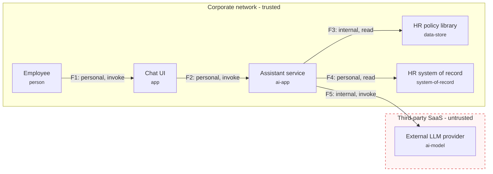

# Architecture diagram — HR Policy Assistant

> Generated by `arch.py` from the architecture model in `sdd/spec.md`. Do not edit.

```mermaid
flowchart LR
  subgraph internal["Corporate network - trusted"]
    employee["Employee<br/><small>person</small>"]
    chat_ui["Chat UI<br/><small>app</small>"]
    assistant["Assistant service<br/><small>ai-app</small>"]
    policy_library["HR policy library<br/><small>data-store</small>"]
    hr_system["HR system of record<br/><small>system-of-record</small>"]
  end
  subgraph external["Third-party SaaS - untrusted"]
    llm_provider["External LLM provider<br/><small>ai-model</small>"]
  end
  employee -->|"F1: personal, invoke"| chat_ui
  chat_ui -->|"F2: personal, invoke"| assistant
  assistant -->|"F3: internal, read"| policy_library
  assistant -->|"F4: personal, read"| hr_system
  assistant -->|"F5: internal, invoke"| llm_provider
  style external fill:#fff5f5,stroke:#d62728,stroke-dasharray: 5 5
```
